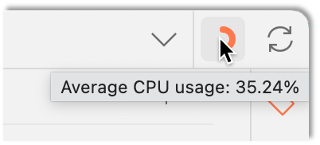
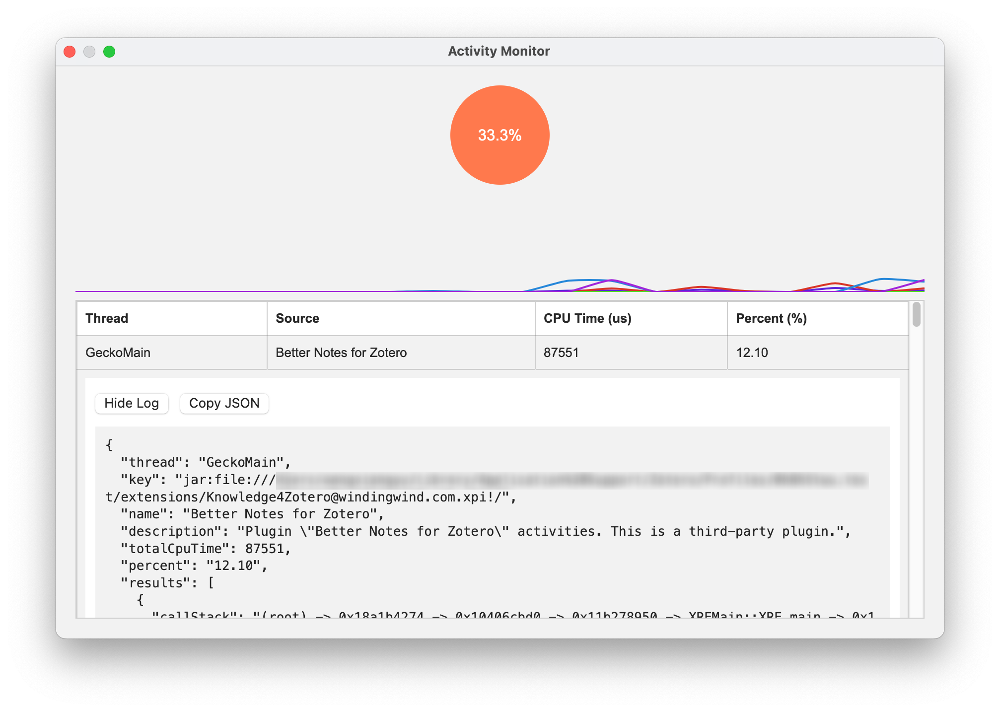

# Know Ur Zotero: Status Monitoring and Analysis

[](https://www.zotero.org)
[](https://github.com/windingwind/zotero-plugin-template)

<div align="center">
  
</div>

## 🧩 Outline

[🧐 What is this?](#-what-is-this)

[👋 Install](#-install)

[🧲 API](#-api)

[🔧 Development](#-development)

[🔔 Disclaimer](#-disclaimer)

## 🧐 What is this?

This plugin can monitor the status of the Zotero desktop app with:

- **Activity Monitor**: Monitor the CPU usage of diffrent activities in Zotero. Useful for plugin debugging and performance optimization.



- **Status Indicator**: Show the status of the Zotero app in the toolbar.

<div align="center">
  
</div>

- **Activity Log**: Log the status to file (menu: `Tools` -> `Start Recording Activity`).

## 👋 Install

- Download the plugin (.xpi file) from below.
  - [Latest Stable](https://github.com/windingwind/know-ur-zotero/releases/latest)
  - [All Releases](https://github.com/windingwind/know-ur-zotero/releases)

  _Note_: If you're using Firefox as your browser, right-click the `.xpi` and select "Save As.."

- In Zotero click `Tools` in the top menu bar and then click `Plugins`
- Go to the Extensions page and then click the gear icon in the top right.
- Select `Install Add-on from file`.
- Browse to where you downloaded the `.xpi` file and select it.
- Finish!

## 🧲 API

KuZ provides APIs for plugin developers in `Zotero.kuZ.api.${API_MODULE}`. See [`api.ts`](src/api.ts).

- `profiler`: Monitor the CPU usage of different activities in Zotero.

## 🔧 Development

This plugin is built based on the [Zotero Plugin Template](https://github.com/windingwind/zotero-plugin-template). See the setup and debug details there.

To start, run

```bash
git clone https://github.com/windingwind/know-ur-zotero.git
cd know-ur-zotero
npm install
npm run build
```

The plugin is built to `.scaffold/build/*.xpi`.

To debug, run

```bash
npm run start
```

This will open a new Zotero instance with the plugin installed.

## 🔔 Disclaimer

Use this code under AGPL. No warranties are provided. Keep the laws of your locality in mind!
